# Rossman Store Sales

## This project aims to bring a daily forecast for the next 6 weeks of sales

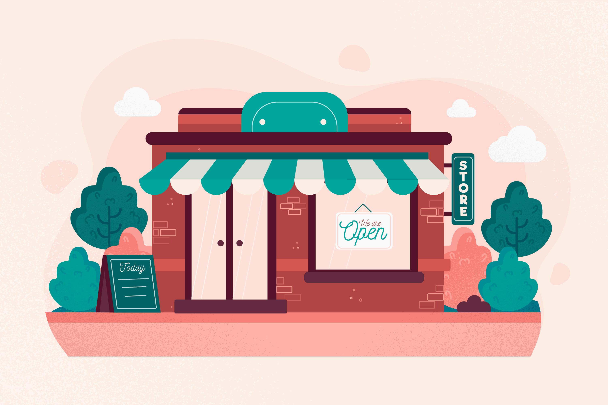

#### This project was made by Emerson Hideki Miady.

# 1. Business Problem

The Rossmann company's CFO held a meeting with all store managers and asked each of them to bring a daily forecast for the next 6 weeks of sales.

After this meeting, all managers contacted you, requesting a sales forecast for your store.

**Note:** The data was made available [here](https://www.kaggle.com/c/rossmann-store-sales).

# 2. Business Assumptions

- Normally all stores, with few exceptions, are closed on state holidays

- The max value of the competition distance in dataset is: 75,860m. Then the NaN values in this variable was filled with a huge value, like 200,000m

- About some other features:
    - `customers`: we don't have the number of customers on a given day on the future, so we can't put this on the algorithm.
    - `open`: is this really necessary? If the store is closed (0), there aren't sales! But, on the other hand, we want the lines with `open` == 1. So, we only have to exclude the lines with `open` == 0 and after, exclude this variable.
    - `sales`: only sales above 0 are really necessary for the model!

# 3. Solution Strategy

- Granularity and problem type: daily sales forecast in cash for the next 6 weeks

- Potential resolution methods: Time Series, Regression, Neural Networks

- Delivery format:
    1. The total sales amount at the end of 6 weeks
    2. Possibility of checking the value by cell phone

My strategy to solve this challenge was:

**Step 01. Data Description:** My goal is to use statistics metrics to identify data outside the scope of business.

**Step 02. Feature Engineering:** Derive new attributes based on the original variables to better describe the phenomenon that will be modeled.

**Step 03. Data Filtering:** Filter rows and select columns that do not contain information for modeling or that do not match the scope of the business.

**Step 04. Exploratory Data Analysis:** Explore the data to find insights and better understand the impact of variables on model learning.

**Step 05. Data Preparation:** Prepare the data so that the Machine Learning models can learn the specifc behaviour. For example, scaling and encoding are methods to this section.

**Step 06. Feature Selection:** Selection of the most significant attributes for training the model.

**Step 07. Machine Learning Modelling:** Machine Learning model training.

**Step 08. Hyperparameter Fine Tunning:** Choose the best value for each of the parameters
 of the model selected from the previous step.

**Step 09. Convert Model Performance to Business Values:** Convert the performance of the Machine Learning model into a business resut. 

**Step 10. Deploy Modelo to Production:** Publish the model in a cloud environment so that other people or services can use the results to improve the business decision.

# 4. Top 3 Data Insights

**Hypothesis 01:** Stores with a larger assortment should sell more.

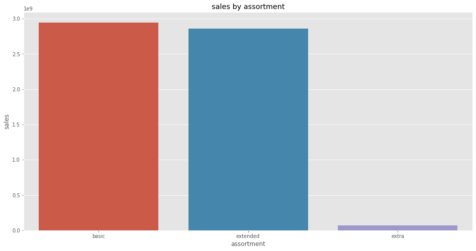

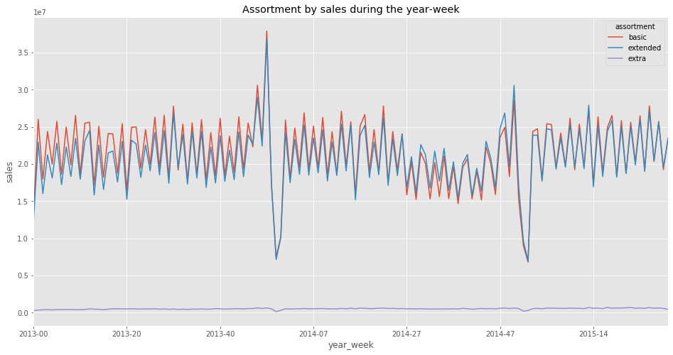

On the positive side, the extra assortment sales is growing up!

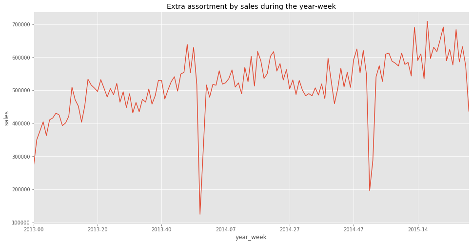

**FALSE.** Extra assortment stores sell less.

**Hypothesis 02:** Stores with closer competitors should sell less.

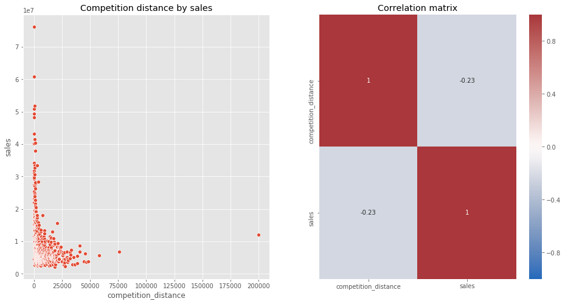

The sales data are concentrated on lower competition distances, and the higher values of sum of the sales too! Also, we know the Pearson's correlation, and this value is low.

Let's see sales in relation to the closest distances, that is, from 0 to 20,000 meters.

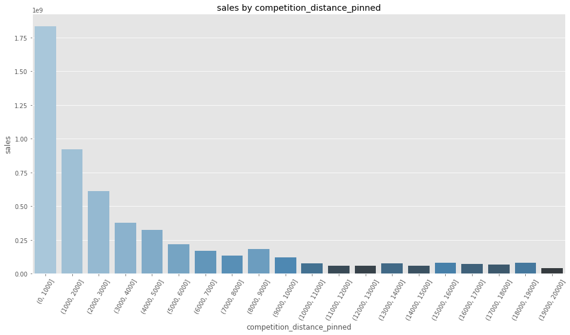

The higher sum of sales is on the 0 to 1,000 meters interval! So, in a strange way, we can conclude that with more competition, more sales!

**FALSE.** Stores with closer competitors sell more.

**Hypothesis 03:** Stores with promotions actived for longer should sell more.

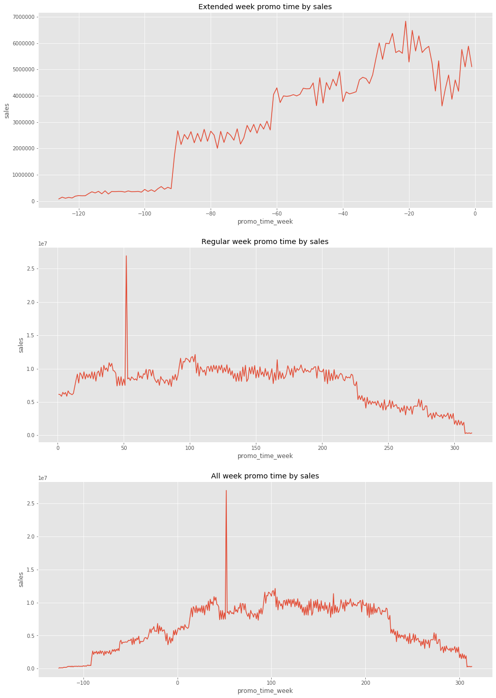

**Notes:** 
- Week promo time = Current week - Promo week. So negative values means extended and positive means regular promo time.
- Extended week promo time: when promo week is on the future, i.e. we're going to have the `promo2` in a few weeks.
- Regular week promo time: when promo week have already started, i.e. we are in the `promo2` now.
- I've dropped zeros in promo_time_week because the sum of sales is very high, causing it to distort the line plot.

Looking at the first lineplot, we can conclude that `promo2` doesn't has high sum of sales in weeks far away. And if we have the `promo2` in approximately 90 weeks, the amount of sales starts to go up.

Looking at the second lineplot, we can conclude that sales remain constant for a period of approximately 225 weeks in `promo2`. After that, sales sales start to go down.

**FALSE.** Promotions actived for longer tend to sell less.

# 5. Machine Learning Model Applied

1. I used **Boruta** with a standard Random Forest to select the most important features.

**Selected features:** 'store', 'promo', 'store_type', 'assortment', 'competition_distance', 'competition_open_since_month', 'competition_open_since_year', 'promo2', 'promo2_since_week', 'promo2_since_year', 'competition_time_month', 'promo_time_week', 'day_of_week_sin', 'day_of_week_cos', 'month_sin', 'month_cos', 'day_sin', 'day_cos', 'week_of_year_sin', 'week_of_year_cos'

2. After feature selection, I've tried to train:
    - **Average Model (baseline)**
    - **Linear Regression**
    - **Lasso**
    - **Random Forest Regressor**
    - **XGBoost Regressor**

3. The best performance was with **XGBoost Regressor**, it was faster than Random Forest and its metrics weren't bad. Then, to maximize the results, I've tunned the hyperparameters for XGBoost, and obtained better results.

# 6. Machine Learning Modelo Performance

The first version of the models gave this results:

**Test:**
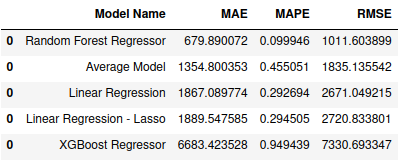

**Cross-validation:**
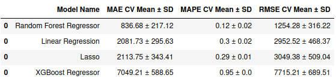

So, the chosen one was XGBoost. Then I tried to tune its parameters, getting some models as a proposal:

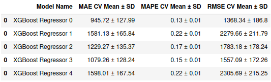

The chosen one was the third:

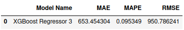

And the error distribution of testing data is in the following:

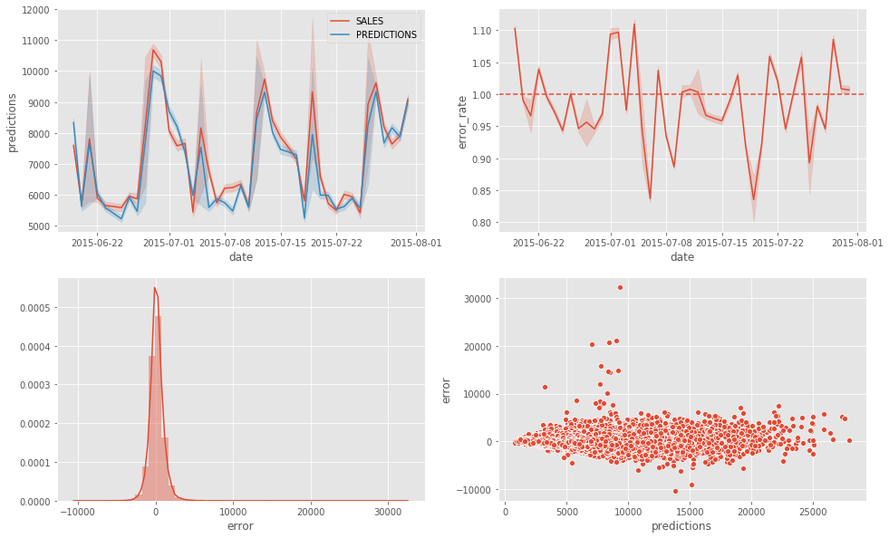

# 7. Business Results

For each store, I can show the best and worst scenarios of money return:

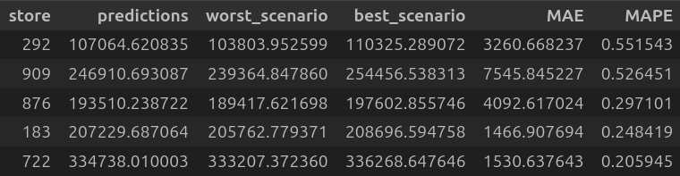

And the total of testing data returns:

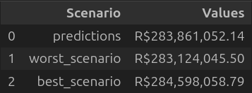

# 8. Conclusions

The predictions of the best xgboost have low errors in test data, indicating that is a good model!

Furthermore, I got my objective, create predictions for each of the store sales in the next 6 weeks, giving the worst and best scenarios.

# 9. Lessons Learned

- Business context of store sales

- Financial return as business return, how to estimate and give the worst and best scenarios

# 10. Next Steps to Improve

- Get the SHAP of XGBoost - feature importances of the model

- Build some presentation in PPT to show the results and conclusions for the stakeholders

- Build a bot on telegram that spam what the prediction sale for a giving store, I haven't built it yet because the rendler server isn't working with my python version, so I have to upgrade it and try again 

- Build a model monitoring and stay aware when the model will need to be retrained

# LICENSE

# All Rights Reserved - Comunidade DS 2021